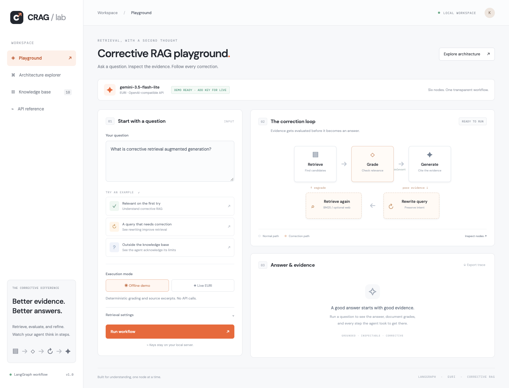
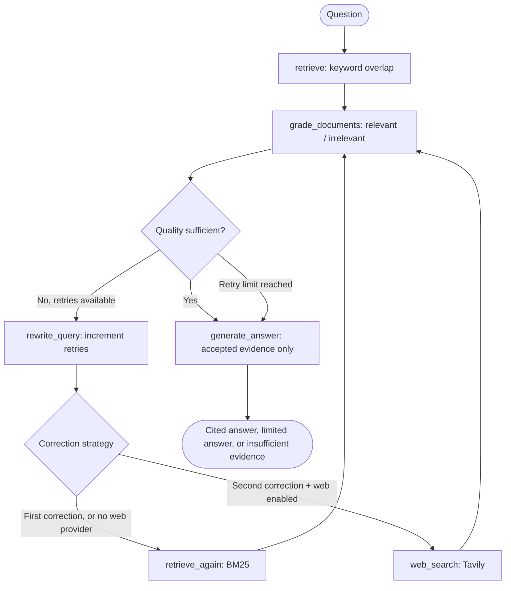
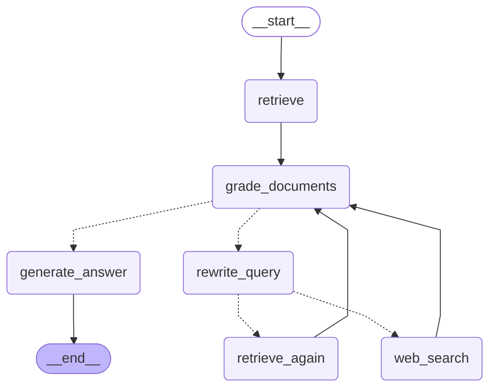

# Corrective RAG Lab

A simplified **Corrective Retrieval-Augmented Generation agent built with LangGraph**, using **EURI** and **`gemini-3.5-flash-lite`** through the OpenAI Python client.

The agent retrieves documents, grades their relevance, and corrects poor retrieval by rewriting the query and searching again. A browser playground makes the answer, accepted/rejected evidence, and execution trace visible. A standalone architecture explorer explains the actual code and replays saved executions.

**Try without a key:** the explicitly labeled offline demo runs the same compiled LangGraph using deterministic grading and extractive answers. **Live EURI mode** uses the requested model for grading, rewriting, and generation.



[View the architecture explorer screenshot](docs/architecture-explorer.png) · [Validation report](docs/VALIDATION.md)

## Quick start

Requires Python 3.11–3.14; Python 3.12 is recommended for this project.

```bash
# From the project directory, using uv:
uv sync --frozen
cp .env.example .env
# Edit .env and set EURI_API_KEY for live mode.
uv run uvicorn crag.api:app --reload --host 127.0.0.1 --port 8000
```

Open **http://127.0.0.1:8000**. Select **Offline demo** to start immediately, or **Live EURI** after configuring your key. Click **Run workflow**.

Using standard pip instead:

```bash
python3 -m venv .venv
source .venv/bin/activate
# Windows PowerShell: .venv\Scripts\Activate.ps1
python -m pip install -r requirements.txt
cp .env.example .env
python -m uvicorn crag.api:app --reload --host 127.0.0.1 --port 8000
```

| Page | Location |
|---|---|
| Playground | http://127.0.0.1:8000 |
| Architecture explorer | http://127.0.0.1:8000/architecture |
| Interactive API docs | http://127.0.0.1:8000/docs |
| Standalone visualizer | [docs/architecture_visualizer.html](docs/architecture_visualizer.html) — download and open in a browser |

The standalone visualizer works without a server, internet, or API key. It embeds actual source snapshots and offline graph runs. It includes node inspection, three scenarios, play/pause, speed, previous/next controls, evidence tables, query changes, and JSON export.

## EURI configuration and live examples

Set this in the local `.env` file:

```dotenv
EURI_API_KEY=your_actual_key_here
EURI_BASE_URL=https://api.euron.one/api/v1/euri
EURI_MODEL=gemini-3.5-flash-lite
TAVILY_API_KEY=
```

The correct credential name is **`EURI_API_KEY`**, including the `I`. `.env` is ignored by Git and excluded from Docker builds. Keys stay on the server and are never included in browser responses or saved graph traces. Restart the server after changing an already loaded environment variable.

The requested client integration:

```python
import os
from openai import OpenAI

client = OpenAI(
    api_key=os.environ["EURI_API_KEY"],
    base_url="https://api.euron.one/api/v1/euri",
)
resp = client.chat.completions.create(
    model="gemini-3.5-flash-lite",
    messages=[
        {"role": "system", "content": "You are a helpful assistant."},
        {"role": "user", "content": "Write a haiku about the ocean."},
    ],
    temperature=0.7,
)
print(resp.choices[0].message.content)
```

Run the provided minimal example, which also loads `.env`:

```bash
uv run python scripts/live_example.py
```

Run the full CRAG workflow with the live model and save its evidence and decisions:

```bash
uv run python -m crag "What is corrective retrieval augmented generation?" \
  --mode live --output artifacts/live-direct.json

uv run python -m crag "My bot finds junk" \
  --mode live --output artifacts/live-correction.json
```

The integration is implemented and the exact endpoint/model payload is tested with a mocked HTTP transport. **No live EURI result is claimed without a successful credentialed execution.** Provider account access, credits, and availability of `gemini-3.5-flash-lite` must be confirmed by the live command. Errors never silently select a different model or switch to demo mode.

Live generation validates that citations exist and refer to accepted document IDs. If the model returns malformed grading JSON, omits grades, duplicates IDs, or invents a citation ID, the application reports an error.

## Workflow



The decision diamonds above explain conditional edges; they are not additional Python nodes.

### Compiled LangGraph

This is the graph LangGraph compiles from [`crag/graph.py`](crag/graph.py), exported with `build_graph(...).get_graph().draw_mermaid()`. Solid arrows are fixed edges; dotted arrows are conditional edges (`after_grading` from `grade_documents`, `after_rewrite` from `rewrite_query`). `scripts/build_visualizer.py` regenerates this block, [docs/workflow.mmd](docs/workflow.mmd) and the `/architecture` page, so do not edit it by hand.

<!-- langgraph:start -->

<!-- langgraph:end -->

A rendered image is in [docs/workflow.png](docs/workflow.png).

### Shared state

[`CRAGState`](crag/state.py) holds the immutable `question`, mutable retrieval `query`, current `documents`, individual `grades`, `relevant_documents`, relevance `quality`, `retries`, settings, final `answer`, and `outcome`. The `trace` field uses `Annotated[list[dict], operator.add]`, so each node appends its event. Other state fields are replaced by each update. Each request starts fresh; runs are not persisted unless you export them.

### Every LangGraph node

All six node functions and graph wiring are in [`crag/graph.py`](crag/graph.py).

| Node | Behavior | Next step |
|---|---|---|
| `retrieve` | Searches the local corpus using normalized keyword overlap; returns positive-scoring top-K candidates. | `grade_documents` |
| `grade_documents` | Grades against the **original question**, records binary decisions and reasons, filters context, computes quality. | Conditional: generate or rewrite |
| `rewrite_query` | Refines search terms without changing the original question; increments the retry count. | Conditional: local retrieval or web |
| `retrieve_again` | Uses the rewritten query with BM25, a different lexical scoring strategy. | `grade_documents` |
| `web_search` | Optionally searches Tavily, preserving source URLs. An error produces an empty batch and a trace explanation. | `grade_documents` |
| `generate_answer` | Uses only the current accepted evidence, checks citation IDs, or explains insufficient evidence. | `END` |

### Conditional decisions and termination

1. `quality = relevant_count / retrieved_count`. Empty retrieval has quality `0`.
2. If at least one document is relevant and quality meets `relevance_threshold`, generate.
3. Otherwise, rewrite while `retries < max_retries`.
4. The first correction always tries BM25 locally. On the second correction, web search is used if live mode, the checkbox/CLI flag, and a Tavily key are all present. A subsequent correction returns to BM25; web is attempted at most once.
5. At the retry limit, end correction. Generate a clearly labeled limited answer if some documents remain relevant; otherwise return `insufficient_evidence` without an LLM generation call.

Defaults: **top-K 3**, **threshold 0.5**, **two corrections**. The API allows at most three corrections, and graph execution also sets a recursion limit of 30. Only the latest retrieval batch is used; evidence is not accumulated across attempts.

Relevance ratio is a teaching heuristic, **not** a probability that an answer is true. A relevance grade also does not establish source credibility or complete coverage of a multi-part question.

## Reproducible demo scenarios

| Question | Offline demo behavior |
|---|---|
| `What is corrective retrieval augmented generation?` | Relevant initial evidence → generate directly |
| `My bot finds junk` | Empty initial retrieval → rewrite to precise retrieval/grading terms → BM25 → grade → answer |
| `Who won the 2026 intergalactic chess championship?` | No evidence → bounded corrections → honest insufficient-evidence result |

```bash
uv run python -m crag "My bot finds junk" --mode demo --output artifacts/demo.json
```

The demo's phrase expansion and keyword grading are deliberately deterministic teaching substitutes, documented in `DemoModel`. Live EURI grading and rewriting may choose different paths. Saved runs are in [docs/demo_runs.json](docs/demo_runs.json). The `direct`, `corrected` and `unsupported` runs are **offline executions, not live model outputs**. The `web` run is a real recording against EURI and Tavily. `build_visualizer.py` re-records it when `EURI_API_KEY` and `TAVILY_API_KEY` are set, and reuses the saved recording otherwise, for example in CI.

### Optional external search

Configure `TAVILY_API_KEY`, choose Live EURI mode, enable web search, and keep at least two corrections:

```bash
uv run python -m crag "What did the latest LangGraph release change?" \
  --mode live --web --max-retries 2 --output artifacts/live-web.json
```

Web search is only reached if both initial and corrected local retrieval fail the grading threshold. It is not forced by the example question. Without Tavily configuration, local correction still works and the output records a warning. Web snippets are graded before generation.

## Knowledge base and retrieval

[`data/knowledge_base.json`](data/knowledge_base.json) contains eight short course/project notes and two unrelated distractors. Each entry is one retrieval unit with a unique `id`, `title`, `text`, and `source`. Edit this file to use your own corpus; keep units short, focused, and their IDs unique. The server reloads the corpus for each run.

This is a **simplified lexical RAG implementation**. Initial retrieval uses token overlap; correction switches to BM25, implemented in [`crag/retrieval.py`](crag/retrieval.py). It does not claim vector embeddings, semantic search, PDF ingestion, automatic chunking, or a production vector database. A small local corpus makes the correction mechanism easy to run and explain.

## Project structure

```text
crag/
  config.py           Environment configuration
  state.py            Typed graph state and validated API inputs
  retrieval.py        Keyword and BM25 retrieval
  llm.py              EURI adapter, grading validation, offline substitute
  search.py           Optional Tavily adapter
  graph.py            Six nodes, conditional edges, correction loop
  service.py          Shared runner and mode selection
  api.py              FastAPI routes and static UI
  __main__.py         Command-line runner
data/knowledge_base.json
web/                  Browser playground: HTML, CSS, JavaScript
docs/
  architecture_visualizer.html  Standalone, generated interactive code guide
  demo_runs.json       Executed offline examples
  workflow.mmd         Export of the compiled LangGraph
  VIDEO_GUIDE.md       Recording outline and narration
  SUBMISSION.md        Publishing and submission instructions
scripts/
  live_example.py      The requested minimal EURI example
  build_visualizer.py  Regenerate code snapshots and demo traces
  visualizer_template.html
tests/                Graph, provider, and API behavior tests
```

## Tests and regeneration

```bash
uv sync --frozen
uv run pytest -q
uv run ruff check .
uv run python scripts/build_visualizer.py
```

Tests execute the compiled LangGraph and cover direct generation, mixed relevant/irrelevant context, query rewriting, strategy switching, empty corpora, retry bounds, partial evidence, optional web success/failure, malformed provider responses, citation IDs, exact EURI routing, missing keys, and request validation. Provider tests use mock transports and spend no credits. GitHub Actions runs the suite on Python 3.11 and 3.12.

Regenerate the visualizer after changing source or corpus so its embedded snapshots stay current. `uv.lock` locks dependencies; `requirements.txt` exports the runtime dependencies for pip and Docker.

## HTTP API

```bash
curl http://127.0.0.1:8000/api/run \
  -H 'Content-Type: application/json' \
  -d '{"question":"My bot finds junk","mode":"demo","top_k":3,"max_retries":2}'
```

Responses include answer, source documents, final grades, quality, correction count, outcome, mode, and the full trace. The playground displays the trace after the request finishes; it does not stream individual node completions.

## Docker

```bash
docker build -t corrective-rag-lab .
docker run --rm --env-file .env -p 127.0.0.1:8000:8000 corrective-rag-lab
```

The application is designed for local coursework. Public hosting would need authentication and request limits to protect the server's provider credentials and credit usage. GitHub Pages can host the **standalone visualizer**, but cannot run the Python backend.

## Troubleshooting

| Symptom | Action |
|---|---|
| Missing `EURI_API_KEY` | Copy `.env.example` to `.env`, add the real key, and select Live EURI. |
| Provider request fails | Check the key, credits, connectivity, and exact model availability with EURI. The project never silently substitutes a model. |
| Invalid grading JSON or citations | Retry; the application rejects invalid model output rather than approving evidence automatically. |
| No web search happens | Enable live mode and web search, configure Tavily, allow at least two corrections, and use a question that local evidence does not cover. |
| Demo answer looks like source text | Expected: demo mode extracts evidence without an LLM. |
| Visualizer source is stale | Run `uv run python scripts/build_visualizer.py`. |
| Port 8000 is occupied | Start Uvicorn with `--port 8001`, then open that port. |

## Assignment and video submission

The code addresses the requested retrieval, binary document grading, conditional correction, query rewriting, alternate retrieval, LangGraph state/nodes/edges/loops, and final output. Use [VIDEO_GUIDE.md](docs/VIDEO_GUIDE.md) to record the explanation, and [SUBMISSION.md](docs/SUBMISSION.md) to publish the repository and submit your two real links.

A YouTube recording and published repository are separate submission steps; placeholder or unverified links are not included as completed submissions.

## References

- [LangGraph Graph API: state, nodes, and conditional edges](https://docs.langchain.com/oss/python/langgraph/graph-api)
- [Official OpenAI Python client](https://github.com/openai/openai-python)
- [Tavily Search API](https://docs.tavily.com/documentation/api-reference/endpoint/search)
- [Architecture explorer inspiration supplied for this project](https://github.com/AIWITHKAUSHAL/Vector_Similiarity/blob/main/docs/architecture_visualizer.html)
